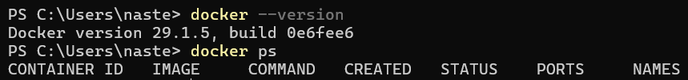
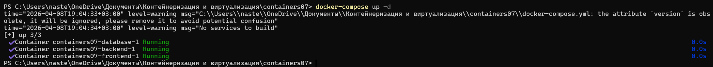
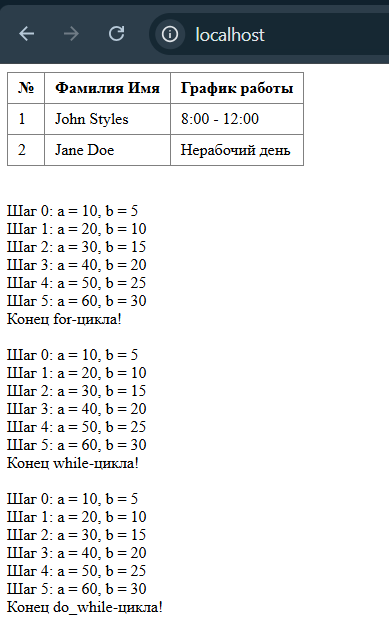

 Лабораторная работа №7:  Создание многоконтейнерного приложения

**Каварналы Анастасия, IA2403** 

**Дата:** 08.04.2026

## Цель работы

Ознакомиться с работой многоконтейнерного приложения на базе `docker-compose`

## Задание

Создать php приложение на базе трех контейнеров: `nginx`, `php-fpm`, `mariadb`, используя `docker-compose`

## Подготовка

Для выполнения данной работы необходимо иметь установленный на компьютере Docker

- Для подтверждения корректной установки и работы Docker выполнена команда

```powershell
docker --version 
docker ps
```



Работа выполняется на базе лабораторной работы №6

В качестве основы использовался репозиторий `containers07`

## Ход выполнения работы

### 1. Подготовка структуры проекта

В корне проекта была создана директория `mounts/site`, в которую необходимо поместить PHP-сайт, разработанный ранее в рамках проекта по php

```php
<?php
$day = date('N');

if ($day == 1 || $day == 3 || $day == 5) {
    $johnSchedule = "8:00 - 12:00";
} else {
    $johnSchedule = "Нерабочий день";
}

if ($day == 2 || $day == 4 || $day == 6) {
    $janeSchedule = "12:00 - 16:00";
} else {
    $janeSchedule = "Нерабочий день";
}
?>

<style>
table {
    border-collapse: collapse;
}
th, td {
    padding: 6px 10px;
    text-align: left;
}
</style>

<table border="1" cellpadding="0" cellspacing="0">
    <tr>
        <th>№</th>
        <th>Фамилия Имя</th>
        <th>График работы</th>
    </tr>
    <tr>
        <td>1</td>
        <td>John Styles</td>
        <td><?= $johnSchedule ?></td>
    </tr>
    <tr>
        <td>2</td>
        <td>Jane Doe</td>
        <td><?= $janeSchedule ?></td>
    </tr>
</table>

<?php

echo "<br><br>";

$a = 0;
$b = 0;

for ($i = 0; $i <= 5; $i++) {
    $a += 10;
    $b += 5;
    echo "Шаг $i: a = $a, b = $b <br>";
}

echo "Конец for-цикла! <br><br>";


$a = 0;
$b = 0;
$i = 0;

while ($i <= 5) {
    $a += 10;
    $b += 5;
    echo "Шаг $i: a = $a, b = $b <br>";
    $i++;
}

echo "Конец while-цикла! <br><br>";


$a = 0;
$b = 0;
$i = 0;

do {
    $a += 10;
    $b += 5;
    echo "Шаг $i: a = $a, b = $b <br>";
    $i++;
} while ($i <= 5);

echo "Конец do_while-цикла! <br><br>";
?>
```

### 2. Настройка файла `.gitignore`

В корне проекта создан файл `.gitignore` со следующим содержимым:

```gitignore
# Ignore files and directories
mounts/site/*
```

Данный файл исключает содержимое каталога `mounts/site` из системы контроля версий

### 3. Настройка `nginx`

В директории `nginx` создан файл `default.conf`:

```nginx
server {
    listen 80;
    server_name _;
    root /var/www/html;
    index index.php;
    location / {
        try_files $uri $uri/ /index.php?$args;
    }
    location ~ \.php$ {
        fastcgi_pass backend:9000;
        fastcgi_index index.php;
        fastcgi_param SCRIPT_FILENAME $document_root$fastcgi_script_name;
        include fastcgi_params;
    }
}
```

**В данной конфигурации:**

- принимает `HTTP-запросы` на `80 порту`;
- корневой каталог сайта внутри контейнера: `/var/www/html`;
- все PHP-файлы передаются на обработку в контейнер `backend`;
- связь между контейнерами выполняется по внутренней сети `docker-compose`;
- если файл не найден, перенаправляет запрос в `index.php`

### 4. Создание файла `docker-compose.yml`

В корне проекта создан файл `docker-compose.yml`:

```yaml
version: '3.9'

services:
  frontend:
    image: nginx:1.19
    volumes:
      - ./mounts/site:/var/www/html
      - ./nginx/default.conf:/etc/nginx/conf.d/default.conf
    ports:
      - "80:80"
    networks:
      - internal
  backend:
    image: php:7.4-fpm
    volumes:
      - ./mounts/site:/var/www/html
    networks:
      - internal
    env_file:
      - mysql.env
  database:
    image: mysql:8.0
    env_file:
      - mysql.env
    networks:
      - internal
    volumes:
      - db_data:/var/lib/mysql

networks:
  internal: {}

volumes:
  db_data: {}
```

**В проекте описаны три сервиса:**

- `frontend` - контейнер на базе `nginx:1.19`;
- `backend` - контейнер на базе `php:7.4-fpm`;
- `database` - контейнер на базе `mysql:8.0`

**Также:**

- сайт монтируется в `/var/www/html`;
- база использует том `db_data`;
- все сервисы подключены к сети `internal`

### 5. Создание файла переменных окружения `mysql.env`

В корне проекта создан файл `mysql.env`:

```env
MYSQL_ROOT_PASSWORD=secret
MYSQL_DATABASE=app
MYSQL_USER=user
MYSQL_PASSWORD=secret
```

Этот файл используется для передачи параметров подключения к базе данных в контейнер базы данных и PHP-контейнер

### 6. Запуск контейнеров

Для запуска приложения использовалась команда:

```bash
docker-compose up -d
```



В результате выполнения команды `docker-compose up -d` Docker Compose обработал файл `docker-compose.yml` и запустил контейнеры проекта в фоновом режиме. В консоли отображается предупреждение о том, что параметр `version` является устаревшим, а также сообщение `No services to build`, которое означает, что сборка образов не требовалась. После этого были успешно запущены контейнеры `containers07-database-1`, `containers07-backend-1` и `containers07-frontend-1`, все со статусом `Running`

### 7. Проверка работы приложения

После запуска контейнеров сайт проверяется в браузере по адресу:

```text
http://localhost
```



Приложение успешно отобразило PHP-страницу с таблицей сотрудников, их графиком работы и результатами выполнения циклов `for`, `while` и `do-while`

## Контрольные вопросы

**1. В каком порядке запускаются контейнеры?**

При запуске проекта Docker Compose сначала создает общие ресурсы, например сеть и том для базы данных, а затем запускает контейнеры. Поскольку в файле `docker-compose.yml` не указан параметр `depends_on`, строгий порядок запуска сервисов `frontend`, `backend` и `database` явно не задается

**2. Где хранятся данные базы данных?**

Данные базы не хранятся только внутри контейнера. Для этого в проекте используется отдельный Docker volume `db_data`. Он подключается к контейнеру базы данных в директорию `/var/lib/mysql`. За счет этого информация сохраняется даже после остановки или пересоздания контейнера

**3. Как называются контейнеры проекта?**

Контейнеры проекта получают имена по шаблону имя_проекта-имя_сервиса-номер. В данном случае это могут быть `containers07-frontend-1`, `containers07-backend-1` и `containers07-database-1`

**4. Вам необходимо добавить еще один файл `app.env` с переменной окружения `APP_VERSION` для сервисов `backend` и `frontend`. Как это сделать?**

Для этого нужно в корне проекта создать новый файл `app.env` и записать в него переменную, например `APP_VERSION=1.0.0`. Затем этот файл надо подключить в `docker-compose.yml` для сервисов `frontend` и `backend` через параметр `env_file`. После этого оба контейнера смогут использовать переменную `APP_VERSION` при запуске

## Используемые источники

1. [Docker Compose: основы работы с контейнерами и с файлом `yml`](https://selectel.ru/blog/docker-compose/)

2. [Официальная документация nginx](https://nginx.org/ru/docs/)

3. [Moodle](https://elearning.usm.md/course/view.php?id=6806)

4. [Хабр. `Nginx + PHP + MySQL` в Docker](https://habr.com/ru/articles/460173/)

## Вывод

В ходе выполнения лабораторной работы было создано многоконтейнерное приложение с использованием Docker Compose. В процессе работы была настроена совместная работа веб-сервера Nginx, обработчика PHP через php-fpm и базы данных. Также была изучена структура файла `docker-compose.yml`, принцип подключения томов, сети и переменных окружения. В результате проект был успешно запущен в контейнерах, а сайт стал доступен через браузер.